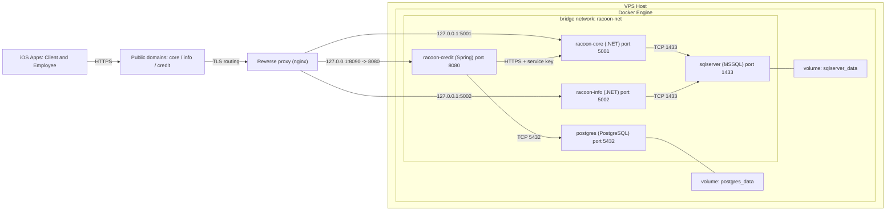

# Racoon-Bank
Design patterns project
To clone use
```
git clone --recurse-submodules [git@github.com:Dark-Type/<meta-repo>.git](https://github.com/Racoon-bank/Racoon-Bank/)
```
To update use

```
git pull

git submodule update --init --recursive

git submodule update --remote --merge

#then commit

```

